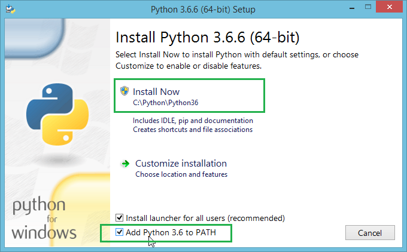

# Sécurité entre MS et GSM 

## Marche à suivre 

Cloner le repo 
```shell
git clone https://github.com/JackyFlip/python-mobile-security.git
```
### Sous Windows

Installer python via le lien suivant : https://www.python.org/downloads/

Attention à ne pas oublier d'ajouter python au PATH comme suit : 


Ouvrir un terminal dans le répertoire du projet et taper les commandes suivantes :
```shell
python -m venv venv
venv\Scripts\activate
pip install --upgrade pip
pip install -r requirements
```

### Sous Linux

Ouvrir un terminal dans le répertoire du projet et taper les commandes suivantes :
```shell
python -m venv venv
source venv/bin/activate
pip install --upgrade pip
pip install -r requirements
```

### Après installation

Ouvrir 2 consoles, exécuter dans la première :

```shell
python server-probe.py
```

Et dans la seconde :

```shell
python client-probe.py
```

## Déroulé des étapes

### Connexion

Lorsque le serveur démarre, il attend une connection d'un client. Le client, une fois démarré, se connecte au 
serveur. 

### Authentification

La première étape est d'authentifier le client. Pour ce faire, le serveur envoie un challenge généré aléatoirement au client. Ce challenge est résolu après un calcul avec la clé secrète Ki, enregistrée localement de chaque côté. Le client envoie le résultat obtenu, que le serveur va ensuite comparer avec son propre résultat après réception du paquet. Si les résultats sont égaux, cela signifie que la clé du côté client (dans la carte SIM) est la même que celle du côté serveur (dans la base de données). L'authentification est ainsi réussie. Dans le cas contraire, l'authentification est refusée. 

### Dérivation de clé

Toujours à l'aide de la clé secrète Ki et du challenge, une clé publique Kc est crée. Comme avant, cela se fait de chaque côté, dans le but d'avoir un mot de passe pour le chiffrage et le déchiffrage des données assurant une connection sécurisée. Cette clé est rendue obsolète après 20min, une nouvelle est générée par la suite. 

### Echange de messages

L'envoi de messages se fait par la suite de façon sécurisée. L'algorithme de chiffrage choisi est AES. Ainsi, lorsque des messages sont éhangés, la clé dérivée Kc est utilisée en tant que mot de passe et sert donc à chiffrer les messages du côté de l'envoi et déchiffrer les messages du côté de la réception. 

## Implémentation

### Connexion 

Le serveur est configuré dans la fonction init() puis démarré avec la fonction start(). A ce moment là, le serveur attend d'avoir une demande de connexion d'un client. Du côté client, la configuration ainsi que la connexion au serveur se fait dans la fonction init() puis la fonction main() prend en charge le déroulé des étapes mentionées auparavant. Enfin du côté serveur, un thread est créé pour gérer les interactions avec le client. 

### Authentification

Du côté serveur, la fonction authenticate() prend en charge l'envoi du challenge de même que la comparaison des résultats, déterminant si l'authentification est réussie ou non. Le client à ce moment là, après réception du challenge, calcul la réponse et l'envoie dans la foulée. 

### Dérivation de clé

Après authentification, la dérivation de clé se déroule de la même manière des 2 côtés. La fonction key_management() permet de créer un thread réitérant une nouvelle dérivation de clé toutes les 20min, délai choisi pour la disponibilité de la clé. 

### Echange de messages

Une fois les clés générées, le client initie un échange de messages chiffrés. Les fonctions aes_management_encrypt() et aes_management_decrypt() servent de chiffrage et déchiffrages des messages. Après l'échange, le client demande une déconnexion au serveur. 